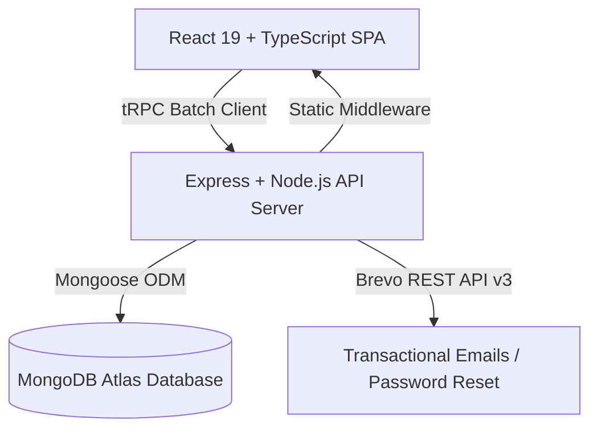

<div align="center">

# 👗 Styly — Next-Gen Fashion Discovery & Creator Commerce Platform

**Empowering fashion creators, connecting designer brands, and enabling seamless multi-brand apparel shopping.**

[](https://responsible-harmony-production-8371.up.railway.app/)
[](https://www.typescriptlang.org/)
[](https://react.dev/)
[](https://nodejs.org/)
[](https://www.mongodb.com/)
[](https://tailwindcss.com/)

</div>

---

## 📖 Table of Contents

- [About Styly](#-about-styly)
- [Key Features](#-key-features)
  - [1. Consumer & Creator Experience](#1-consumer--creator-experience)
  - [2. Multi-Brand Split Checkout](#2-multi-brand-split-checkout)
  - [3. Brand Partner Storefronts](#3-brand-partner-storefronts)
  - [4. Master Admin Console](#4-master-admin-console)
- [Architecture & Tech Stack](#-architecture--tech-stack)
- [Project Directory Structure](#-project-directory-structure)
- [Getting Started](#-getting-started)
- [Environment Variables](#-environment-variables)
- [Security & Best Practices](#-security--best-practices)
- [License & Copyright](#-license--copyright)

---

## 🌟 About Styly

**Styly** is a full-stack social commerce ecosystem designed to bridge the gap between street style inspiration, independent fashion brands, and digital creators. Users can share their curated outfits, tag real garments with direct shopping links, earn commission as their looks convert into sales, and purchase from multiple designer brands in a single, unified shopping bag.

---

## ✨ Key Features

### 1. Consumer & Creator Experience
* **Dynamic Fashion Feed**: High-resolution outfit streams with instant garment tag discovery and click-to-shop interactions.
* **Creator Progression System**: Style Points (XP) reward creators with higher ranks:
  * 🥉 **Grade 1 (Newcomer)** — *2% Base Commission*
  * 🥈 **Grade 2 (Rising Stylist)** — *3.5% Commission*
  * 🥇 **Grade 3 (Trendsetter)** — *5% Commission*
  * 👑 **Grade 4 (Fashion Icon)** — *7.5% Commission*
* **3D Virtual Mannequin Customizer**: Interactive fitting room allowing users to mix and match wardrobe items on custom models.
* **Curated Discovery & Search**: Powerful search by aesthetics, colors, categories, and brand tags.

### 2. Multi-Brand Split Checkout
* **Single Shopping Bag**: Users add items from different brands into one unified bag.
* **Automatic Multi-Brand Dispatch**: Placing an order automatically creates dedicated, per-brand shipments with individualized tracking and fulfillment lifecycles.
* **Flexible Payment Methods**: Full support for Credit/Debit Cards, D17 Mobile Wallet, Flouci, and Cash on Delivery (COD) in Tunisian Dinar (`TND`).

### 3. Brand Partner Storefronts (`/brand`)
* **Dedicated Store Management**: Fashion partners can register their brand, customize their storefront, and list inventory.
* **Real-time Packaging Confirmation**: Brands receive alerts when their items are purchased and update the order state to `Preparing` or `Ready for Pickup`.
* **Sales & Commission Analytics**: Track product popularity, gross sales, and creator referrals.

### 4. Master Admin Console (`/admin`)
* **Executive Overview**: 5 quick-navigation cards linking to **Users**, **Posts**, **Orders**, **Analytics**, and **Brands**.
* **Financial Ledger**: Real-time gain/loss accounting showing Gross Order Volume, Customer Refunds, Creator Commissions Paid, and Retained Net Revenue.
* **Full Moderation Suite**:
  * **Users Directory**: Creator grade displays, Style Points (XP), Admin Crown badges (`👑 Admin`), and instant Ban/Unban controls.
  * **Post Moderation**: Inspect looks with deep financial metrics (Likes, Shares, Estimated Sales, Creator Earnings) and moderation toggles.
  * **Order Fulfillment**: Track multi-brand packaging stages, click **Approve Delivered** to confirm delivery, or click **Refund** to process returns.
  * **Brand Approvals**: Review and approve incoming brand partner applications.
  * **Platform Settings**: Change root admin passwords, toggle email triggers, and manage automation rules.

---

## 🛠️ Architecture & Tech Stack



### **Core Technologies**
* **Frontend**: React 19, TypeScript, Vite, Tailwind CSS v4, Wouter, Radix UI / Shadcn, Lucide React, Recharts, Sonner.
* **Backend**: Node.js, Express, tRPC v11, SuperJSON, Zod, BcryptJS.
* **Database**: MongoDB Atlas with Mongoose schemas.
* **Transactional Email**: Brevo (formerly Sendinblue) v3 REST API via HTTPS Port 443.
* **Deployment**: Railway Cloud Platform with continuous integration from GitHub.

---

## 📂 Project Directory Structure

```
styly-panel/
│
├── 📂 client/              # Frontend React application (Pages, Components, Contexts, Hooks)
│   ├── src/
│   │   ├── components/     # UI primitives, Admin layout, and consumer AppShell
│   │   ├── pages/          # Feed, Shop, Checkout, UserProfile, Admin Console views
│   │   └── App.tsx         # Unified client router
│   └── README.md           # Detailed frontend documentation
│
├── 📂 server/              # Backend Node.js & tRPC server
│   ├── db.ts               # Core database queries and multi-brand order splitter
│   ├── email.ts            # Brevo HTTPS transactional email service
│   ├── mongodb.ts          # Mongoose document schemas & models
│   ├── routers.ts          # tRPC procedures & role-gated endpoints
│   └── README.md           # Detailed backend documentation
│
├── 📂 shared/              # Shared TypeScript contracts, constants & data schemas
│   └── README.md           # Shared layer documentation
│
├── 📂 docs/                # Project documentation, work logs & release notes
│   ├── README.md
│   ├── UPDATE_NOTES.md
│   └── implementation_plan.md
│
└── 📂 misc_assets/         # Design references, test scripts & sample media
    └── README.md
```

---

## 🚀 Getting Started

### Prerequisites
* **Node.js**: v18.0.0 or higher
* **pnpm**: v9.0.0 or higher
* **MongoDB**: Atlas connection URI

### Installation & Local Setup

1. **Clone the repository**:
   ```bash
   git clone https://github.com/7amouch2k01-oss/styly-panel.git
   cd styly-panel
   ```

2. **Install dependencies**:
   ```bash
   pnpm install
   ```

3. **Configure Environment Variables**:
   Create a `.env` file in the root directory:
   ```env
   NODE_ENV=development
   PORT=3000
   MONGODB_URI=mongodb+srv://<username>:<password>@<cluster>.mongodb.net/styly?retryWrites=true&w=majority
   BREVO_API_KEY=xkeysib-your-brevo-api-key
   SESSION_SECRET=your-secure-random-session-secret
   ```

4. **Start the Development Server**:
   ```bash
   pnpm dev
   ```
   * Consumer App: `http://localhost:3000/`
   * Admin Portal: `http://localhost:3000/admin`

5. **Type Check**:
   ```bash
   pnpm check
   ```

6. **Build for Production**:
   ```bash
   pnpm build
   ```

---

## 🔒 Security & Best Practices

* **Role-Based Procedure Gating**: Protected administrative procedures verify root permissions before executing mutations.
* **Encrypted Credentials**: Passwords are saved using multi-round salt hashing (Bcrypt).
* **Safe Email Dispatch**: All transactional emails (password reset, verification) communicate through authenticated REST endpoints over HTTPS Port 443 to eliminate SMTP blocking risks.
* **End-to-End Type Safety**: Input arguments are strictly validated with Zod schemas on every tRPC procedure call.

---

## 📄 License & Copyright

**Copyright © 2026 Styly Platform Inc. All rights reserved.**

This software and associated documentation files are the proprietary property of the Styly development team. Unauthorized copying, distribution, modification, or commercial exploitation of this codebase without prior written permission is strictly prohibited.
